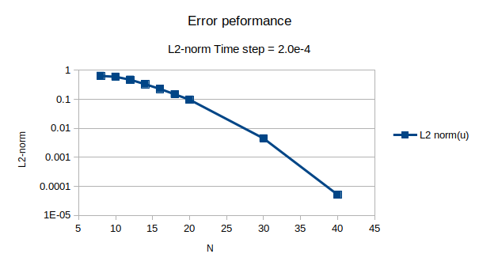
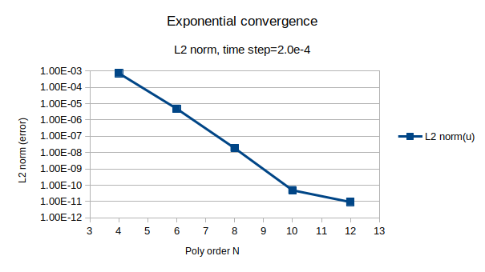
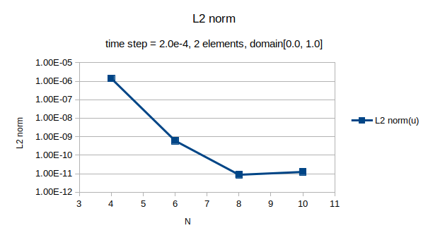

# 2d_DG_advaction_diffusion

## Approximation of wave equation
The basic model of wave propgation is the wave equation. The wave equation is:

The variable `p` might represent the acoustic pressure and `c` would be the sound speed. 

Inspite of solving this PDE, we rewrite it as a system of three first order equations. 

In order to convert the wave equation to a systerm of first order equations, let:

`u` and `v` correspond to the velocities in a fluid flow. Assuming the order of mixed partial derivatives does not matter, then

With proper initial conditions,

The the system of equations becomes a group of equations for the pressure and two velocities componenets:

<a href="https://www.codecogs.com/eqnedit.php?latex=\begin{bmatrix}&space;p\\&space;u\\&space;v&space;\end{bmatrix}_t&space;&plus;&space;\begin{bmatrix}&space;0&space;&&space;c^2&space;&&space;0&space;\\&space;1&space;&&space;0&space;&&space;0\\&space;0&space;&&space;0&space;&&space;0&space;\end{bmatrix}&space;\begin{bmatrix}&space;p\\&space;u\\&space;v&space;\end{bmatrix}_x&space;&plus;&space;\begin{bmatrix}&space;0&space;&&space;0&space;&&space;c^2&space;\\&space;0&space;&&space;0&space;&&space;0\\&space;1&space;&&space;0&space;&&space;0&space;\end{bmatrix}&space;\begin{bmatrix}&space;p\\&space;u\\&space;v&space;\end{bmatrix}_y&space;=0" target="_blank"></a>

Or:

## Numerical flux
We intent to use upwind flux. Which is the upwind side is determined by the sign of the wave speed. Positive wave speed(with respect to x direction) means that the boundary condition is forced on the left. Luckly, the systerm describes the wave equation couples three wave speeds, positive, negative, and zero, with respect to the direction vector . By decoupling the wave components into right going, left going and stationary waves, the outgoing waves are approximated by the interior solution(upwind), and the incoming waves are specified from the external state(also upwind). The derivation of the boundary fluxes is known as **_Riemann problem_**

**Numerical flux** is computed from the internal and external states(with the designation determined relative to the normal at the boundary) as:

One would be able to derive the numerical flux either by diagonlizing the coefficient matrix A, or by using **_Rankine-Hugonist Condition_**, which yields to:

Where,

## Performance

## Test case: 1D wave equation
### Governing equation

With 

The solution is:

We can write the system in conservation law form

With proper initial conditions,

Then we obtain the system of equations by grouping the equations for the pressure and velocity:

### Boundary condition
Exact solution is imposed on both side of the boundaries.

### Numerical fluxes
For wave equation, the natural choice of flux is Lax-Friedrichs flux

If , the numerical flux is the average of the two solutions, known as central flux. For , we recover a flux which always takes information from where it is coming; that is, it is an upwind flux.

In this case the Lax-Friedrichs flux yelds to

### Test case Performance
One element, domain:[-1.0, 1.0]

Two elements, domain:[0.0, 1.0]

## Documentation from the source code
[Source code documentation]( https://shiqihe000.github.io/2d_DG_advaction_diffusion/output/html/index.html)

